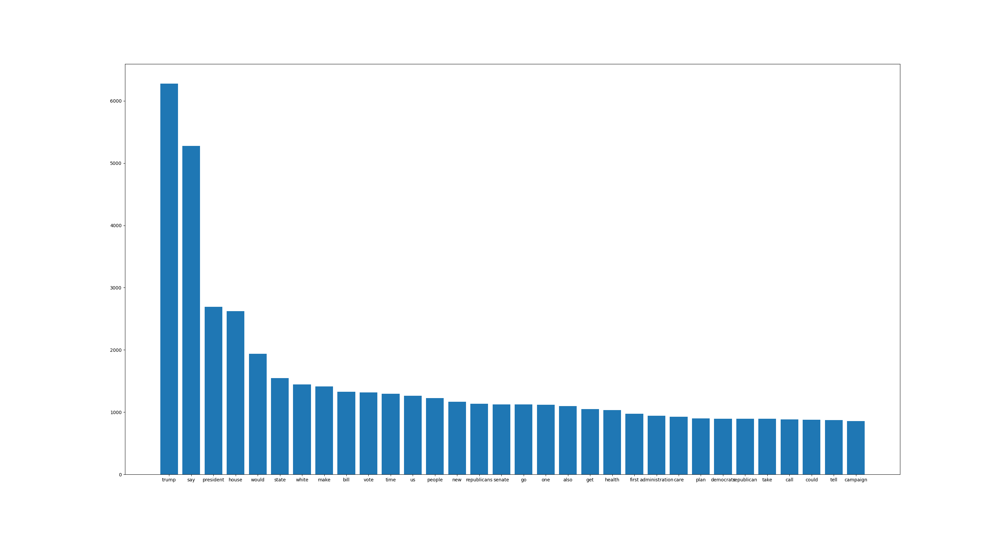

# Political Bias Analysis and Clasification

This project attempts to do Political Bias Classification of Rpublicant and Democratic news.

## Data
We crawled our data from various news sites tend to publish biased news articles towards left or right parties using [**news-please library**](https://github.com/fhamborg/news-please).

To download the raw data from [**urls**](urls/urls.txt), run:
```python
get_data.py -c
```

If you want specific amount of data you can run:
```python
get_data.py -n number -c
```

Raw data will be saved in [**raw data**](data/raw/)

## Preprocessing
Data can be cleaned and tokenized by running:
```python
preprocessing.py -cprt
```
```
usage: preprocess.py [-h] [-c] [-r] [-p] [-t]

cleaning data and tokenizing it.

optional arguments:
  -h, --help  show this help message and exit
  -c          remove old data from clean and token dir
  -r          show results of data clean
  -p          preprocess data and clean data
  -t          tokenize data and wirte them in /data/tokens

```
steps used to clean data:
- expand contractions 
- remove html tags and links
- remove special characters
- removing numbers and words that have number
- convert to lowercase
- remove misc
- remove english stop words

Cleaned Data will be stored in [**clean data**](data/clean/) and the tokenized data will be stored in [**tokens**](data/tokens/).

### Result:



## License

The source code for the site is licensed under the MIT license, which you can find in
the MIT-LICENSE.txt file.

All graphical assets are licensed under the
[Creative Commons Attribution 3.0 Unported License](https://creativecommons.org/licenses/by/3.0/).
